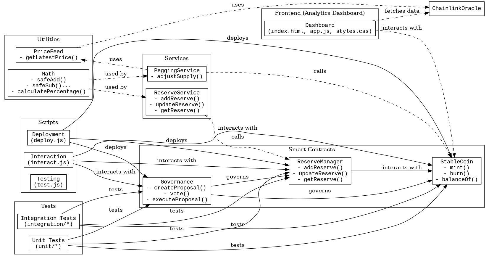

# System Architecture Overview

## Introduction
The PiStable system is designed to create a stablecoin pegged to a specific value, utilizing a decentralized architecture that ensures security, scalability, and community governance. This document outlines the key components and interactions within the system.

## Key Components

### 1. Smart Contracts
- **StableCoin Contract**: Manages the issuance and redemption of the stablecoin, ensuring that the supply is adjusted based on market conditions.
- **ReserveManager Contract**: Oversees the management of reserves that back the stablecoin, including asset diversification and risk management.
- **Governance Contract**: Facilitates community voting and decision-making processes, allowing token holders to influence the direction of the project.

### 2. Off-Chain Components
- **Price Oracles**: External services that provide real-time price data to the smart contracts, enabling accurate pegging of the stablecoin.
- **User  Interface**: A web-based application that allows users to interact with the smart contracts, view their balances, and participate in governance.

## Architecture Diagram

[User Interface] <--> [Smart Contracts] <--> [Price Oracles] | | | | | | [Frontend] [StableCoin] [External Data] [ReserveManager] [Governance]

.
## Security Considerations
- **Auditing**: All smart contracts will undergo rigorous security audits to identify and mitigate vulnerabilities.
- **Decentralization**: The system is designed to minimize single points of failure, ensuring that no single entity can control the stablecoin.

## Conclusion
The architecture of PiStable is built to support a robust and secure stablecoin ecosystem, leveraging both on-chain and off-chain components to achieve its goals.
